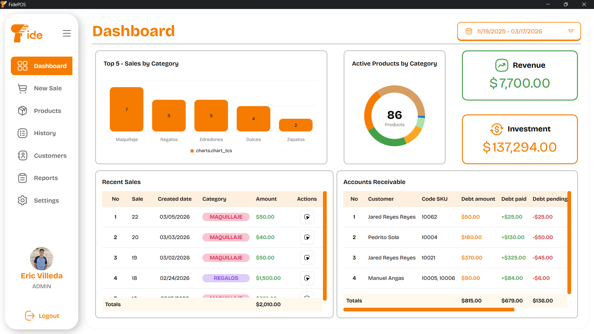
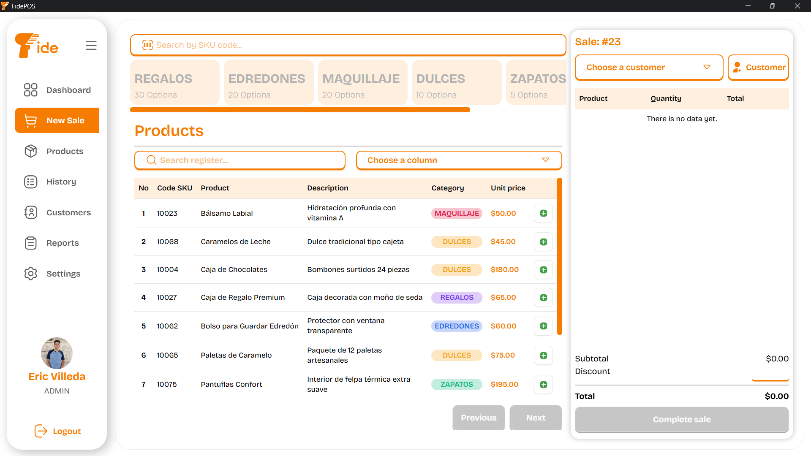
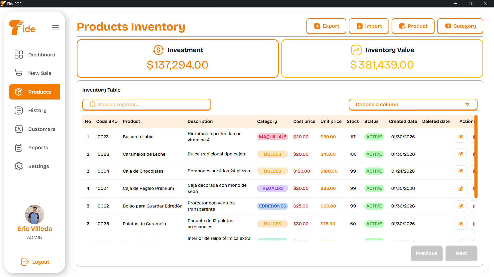
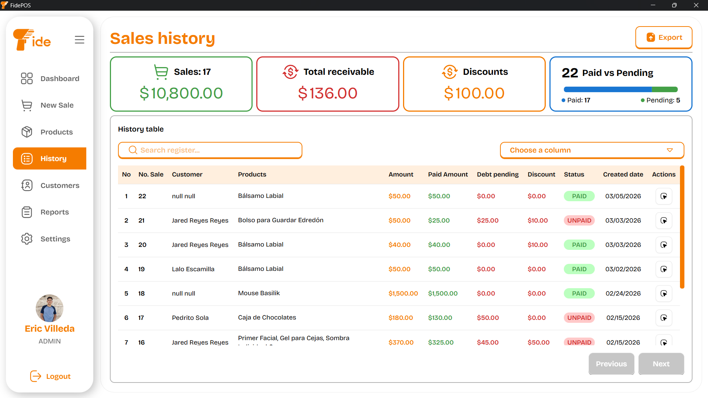
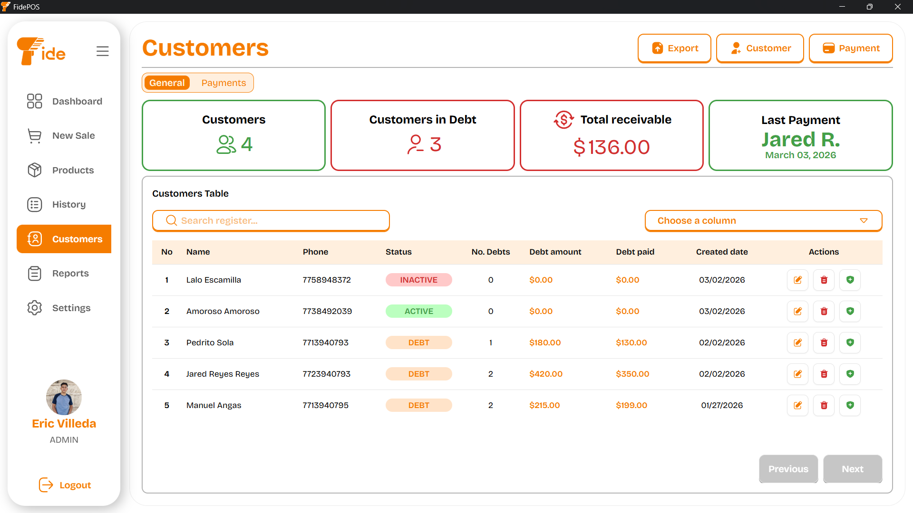
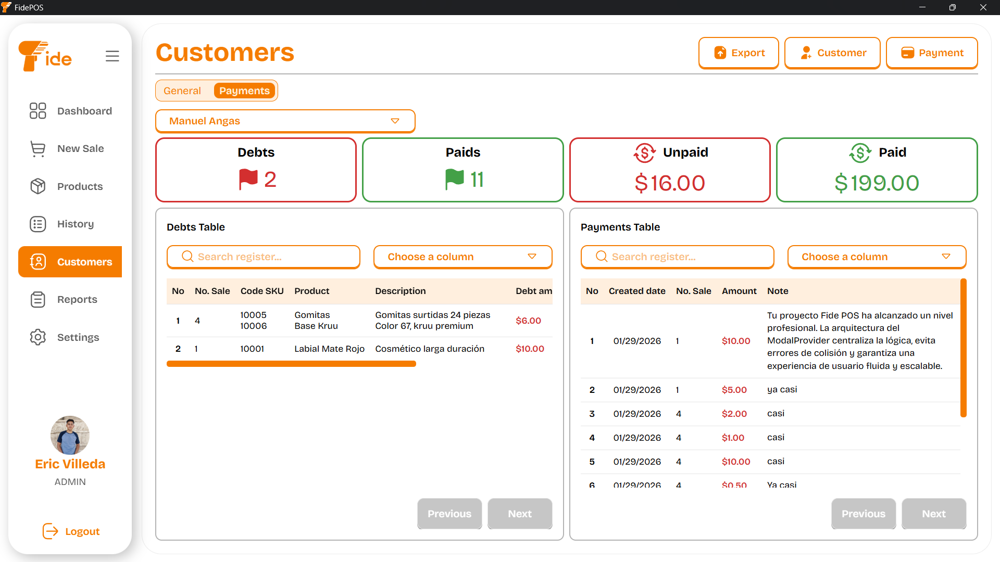
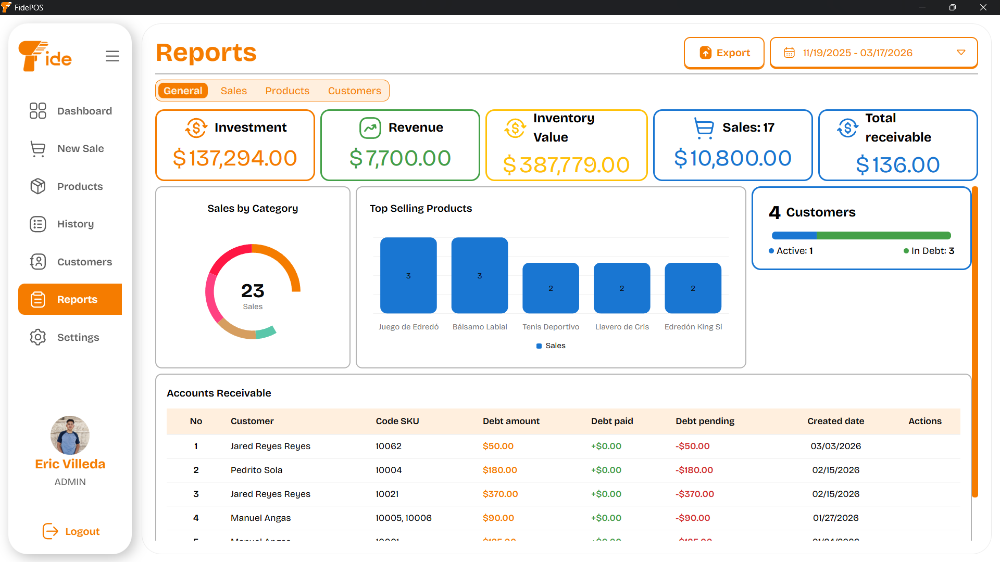
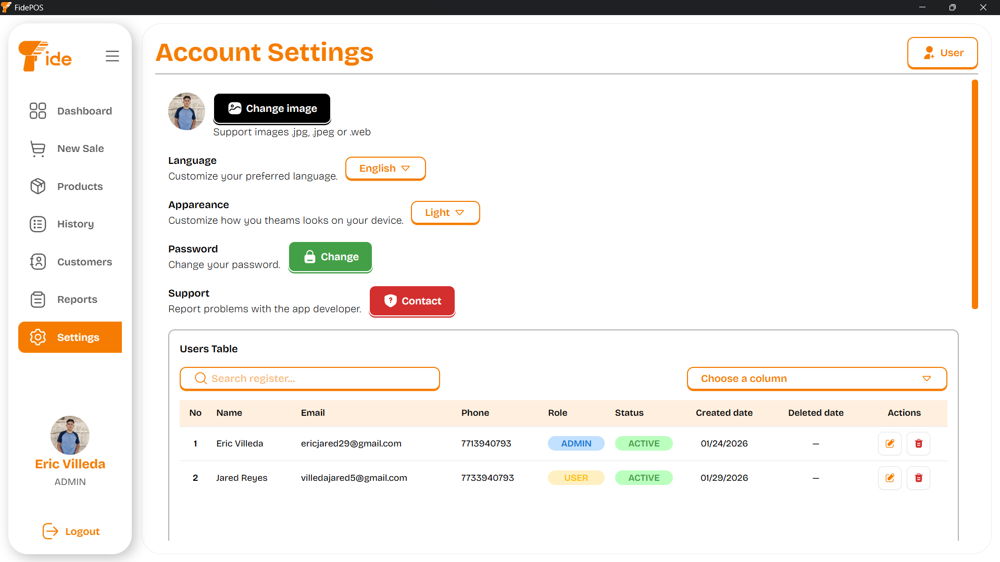

<p align="center">
  
</p>

<h3 align="center">
Aplicación de escritorio de punto de venta para PyMEs. Permite gestionar ventas, inventario, ingresos y pérdidas con reportes claros y en tiempo real, ayudando a mejorar la eficiencia y el control financiero del negocio.
</h3>

---

<h2 align="center">Stack Tecnológico 🧑‍💻</h2>

<p align="center">
  <a href="https://skillicons.dev">
    
  </a>
</p>

## Features 🛠️

- 📦 **Gestión de Inventario:** Control total sobre productos, categorías y stock.
- 👥 **Administración de Clientes:** Seguimiento de deudas, historial de pagos y perfiles.
- 📊 **Dashboard Interactivo:** Visualización de métricas clave y estadísticas de venta mediante gráficas.
- 📄 **Reportes Profesionales:** Generación y exportación de datos en formatos **PDF, Excel y CSV**.
- 🖥️ **Arquitectura de Escritorio:** Ejecución local segura y rápida (vía Electron).
- 🌐 **Soporte Multi-idioma:** Inglés y Español con i18n.

<br/>

> [!NOTE]
> El sistema acutalmente se puede utilizar en modo desarrollo, faltan configuraciones para crear el .exe e instalar la aplicación

<h2 align="center">Project Setup 🚀</h2>

### 📄 Requisitos previos

- Node.js
- npm

### 📁 Clonar Repositorio

To use this project locally, run the following commands in your terminal:

```bash
git clone https://github.com/EricV29/fidePOS.git
cd fidePOS
npm install
```

## 🧩 Available Scripts

### 🔧 Development

Ejecutar modo desarrollo (Vite y Electron):

```bash
npm run dev
```

### 🏗️ Build

Generar Build de producción:

```bash
npm run build
```

### 📦 Distribución

Genera un paquete de producción utilizando electron-builder:

```bash
npm run dist
```

### 🧹 Limpieza

Elimina todas las carpetas de salida (`dist` y `releases`):

```bash
npm run clean
```

### 🧩 Empaquetado completo

Limpia, construye y empaqueta todo el proyecto con un solo comando:

```bash
npm run package
```

### 📁 Estructura del proyecto

```
📁 project/
┣ 📂 constants/
┣ 📂 electron/
┃ ┣ 📜 main.cjs
┃ ┣ 📜 preload.js
┃ ┗ 📂 db/
┃   ┣ 📜 database.js
┃   ┗ 📂 queries/
┃
┃ ┗ 📂 utility/
┃
┣ 📂 public/
┃
┣ 📂 src/ → React frontend
┃ ┣ 📜 App.tsx
┃ ┣ 📜 i18n.tsx
┃ ┣ 📜 main.tsx
┃ ┣ 📜 index.css
┃ ┣ 📂 assets/
┃ ┣ 📂 components/
┃ ┣ 📂 constext/
┃ ┣ 📂 lib/
┃ ┣ 📂 locales/
┃ ┣ 📂 pages/
┃ ┗ 📂 types/
┃ ┗ 📂 utility/
┃
┣ 📦 dist/ → Vite build output
┣ 📦 releases/ → Electron Builder output (installers)
┣ 📜 package.json
┣ ⚙️ tsconfig.ts
┣ ⚙️ tailwind.config.js
┗ ⚙️ vite.config.ts
```

## 📸 Sistema

| Vista del Sistema                                   | Descripción                                                                                                                              |
| :-------------------------------------------------- | :--------------------------------------------------------------------------------------------------------------------------------------- |
|     | **Panel Principal:** Visualización de métricas de ventas diarias, ganancias y estado general del negocio mediante gráficas interactivas. |
|    | **Ventas:** Interfaz ágil para registrar nuevas ventas, aplicar descuentos y procesar diferentes métodos de pago.                        |
|    | **Inventario:** Control total de stock, categorías y precios.                                                                            |
|        | **Historial de Ventas:** Registro cronológico detallado de todas las transacciones realizadas.                                           |
|  | **Clientes:** Directorio centralizado para gestionar la información de contacto y perfiles de compradores frecuentes.                    |
|    | **Deudas y Pagos de Clientes:** Seguimiento especializado de créditos, saldos pendientes y registro histórico de abonos de clientes.     |
|         | **Reportes:** Interfaz Herramienta para exportar métricas de rendimiento y cierres de caja en formatos profesionales como PDF y Excel.   |
|    | **Configuración:** Personalización del sistema, gestión de usuarios y gestion de categorías.                                             |
