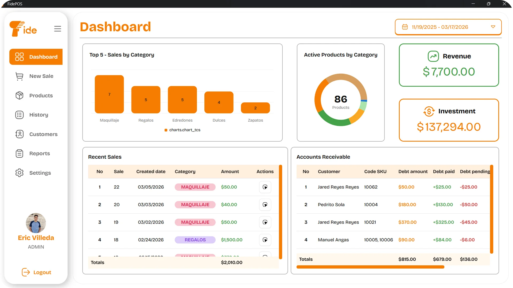
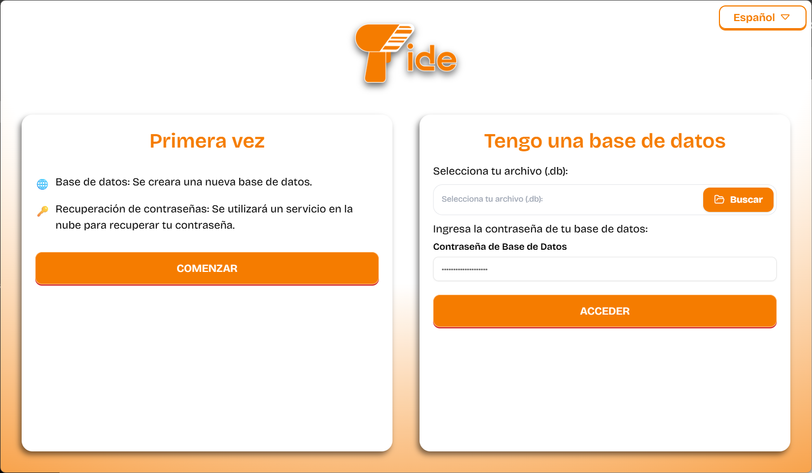
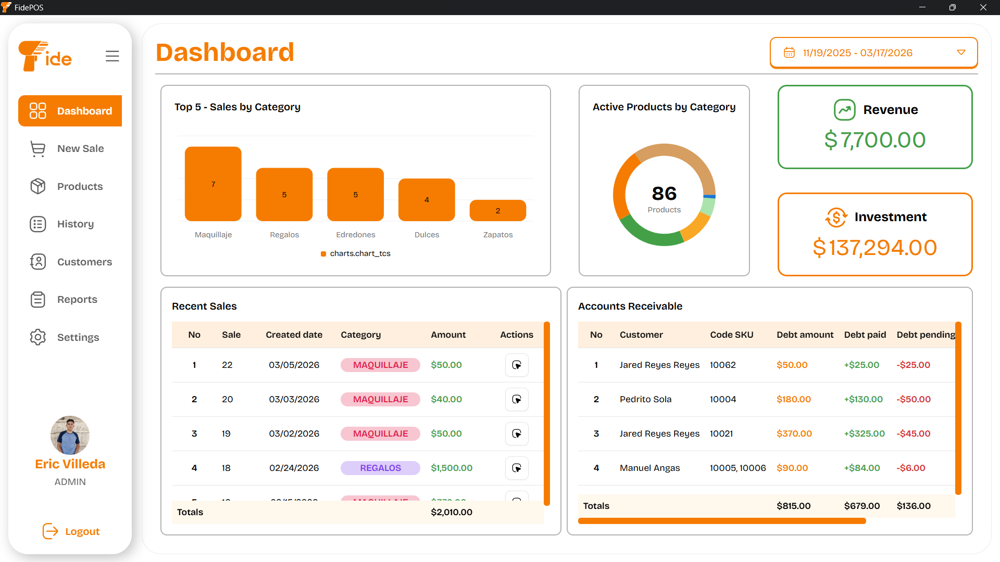
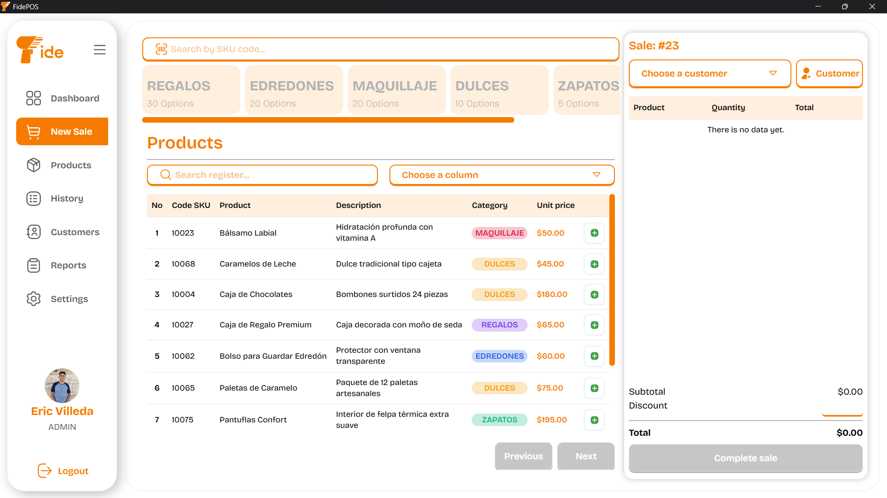
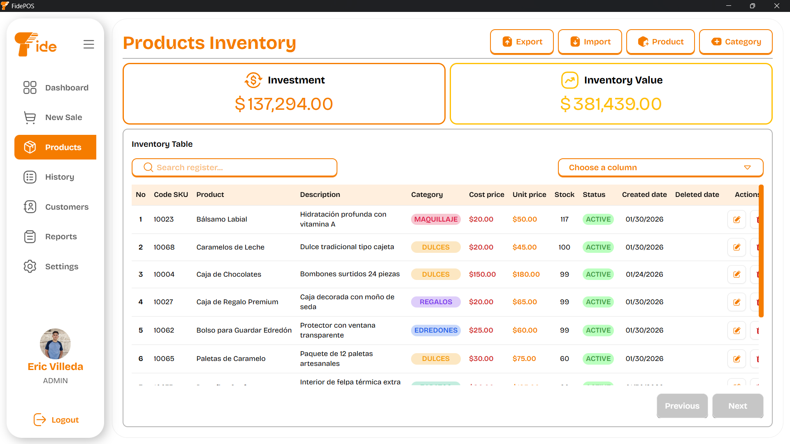
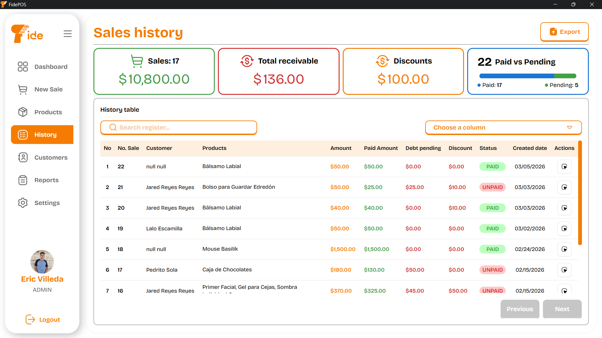
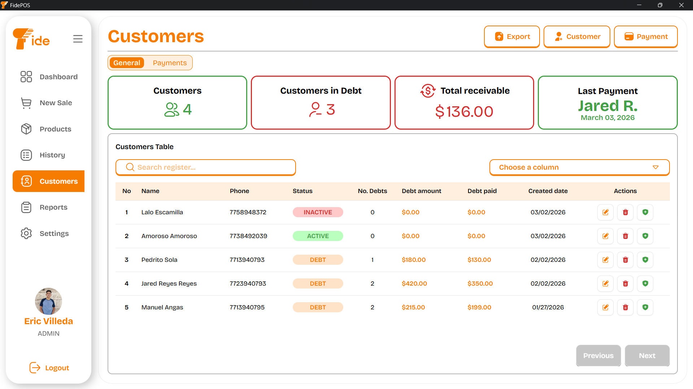
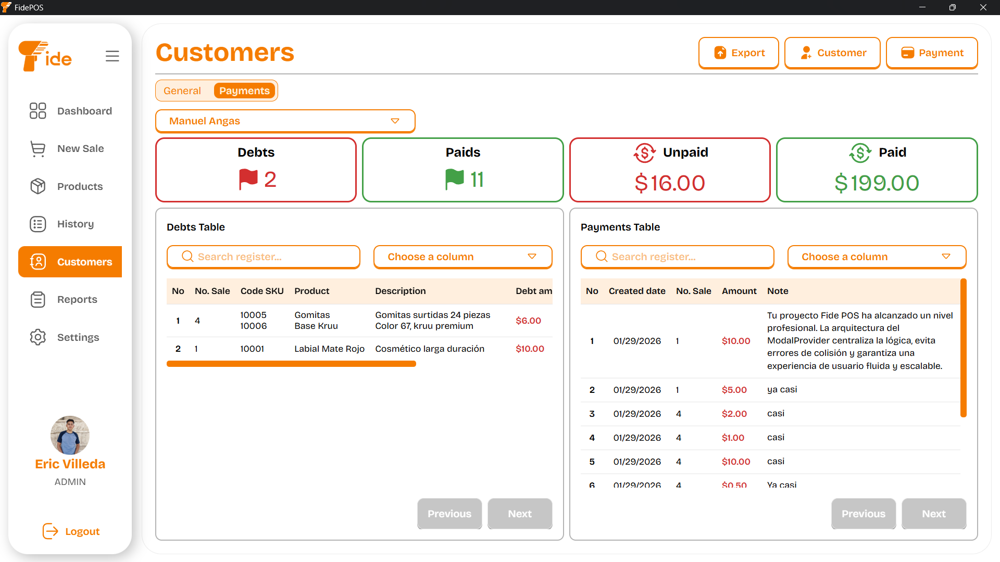
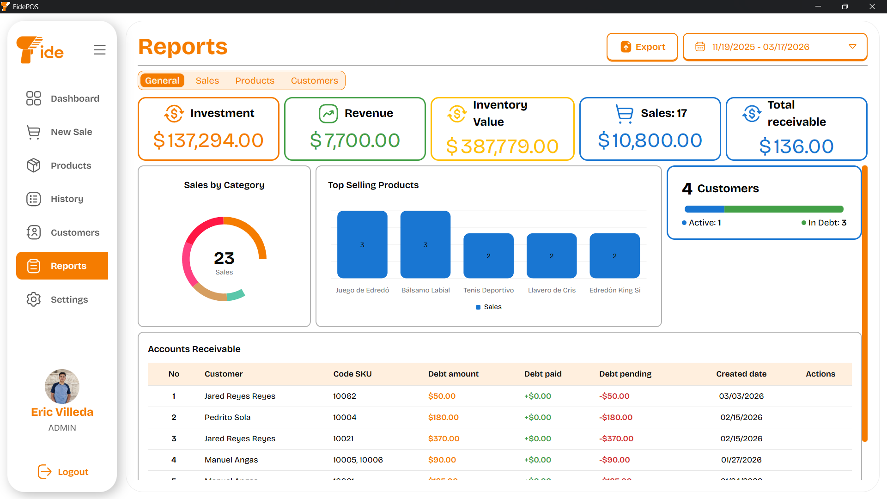
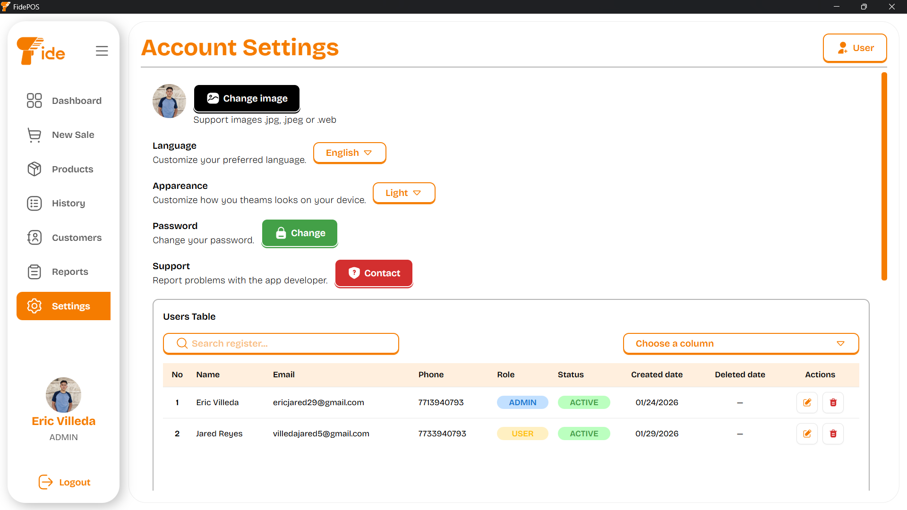

<div align="center">
    

# FidePOS - Punto de Venta

Aplicación de escritorio de punto de venta para PyMEs. Permite gestionar ventas, inventario, ingresos y pérdidas con reportes claros y en tiempo real, ayudando a mejorar la eficiencia y el control financiero del negocio.

  
</div>

#

<p align="center" >
  <a href="https://skillicons.dev">
    
    
  </a>
  <br />
  
  
  
  
  
  
  
  
  
</p>

## 📋 Tabla de contenidos

- [FidePOS - Punto de Venta](#fidepos---punto-de-venta)
- [](#)
  - [📋 Tabla de contenidos](#-tabla-de-contenidos)
  - [📖 Descripción](#-descripción)
  - [🎥 Demo](#-demo)
  - [🛠️ Tecnologías](#️-tecnologías)
  - [✅ Requisitos previos](#-requisitos-previos)
  - [🚀 Instalación](#-instalación)
  - [⚙️ Configuración](#️-configuración)
  - [💻 Uso y Scripts](#-uso-y-scripts)
  - [📸 Sistema](#-sistema)
  - [📁 Estructura del proyecto](#-estructura-del-proyecto)
  - [📄 Licencia](#-licencia)

---

## 📖 Descripción

**FidePOS** Aplicación de escritorio de punto de venta para PyMEs. Permite gestionar ventas, inventario, ingresos y pérdidas con reportes claros y en tiempo real, ayudando a mejorar la eficiencia y el control financiero del negocio.

- 📦 **Gestión de Inventario:** Control total sobre productos, categorías y stock.
- 👥 **Administración de Clientes:** Seguimiento de deudas, historial de pagos y perfiles.
- 📊 **Dashboard Interactivo:** Visualización de métricas clave y estadísticas de venta mediante gráficas.
- 📄 **Reportes Profesionales:** Generación y exportación de datos en formatos **PDF, Excel y CSV**.
- 🖥️ **Arquitectura de Escritorio:** Ejecución local segura y rápida (vía Electron).
- 🌐 **Soporte Multi-idioma:** Inglés y Español con i18n.

> [!IMPORTANT]
> ⚠️ Configuración de Credenciales de Correo (Opción: Importar Archivo)
>
> Actualmente, el sistema presenta una limitación técnica al utilizar la Opción 2 (Importar base de datos existente).
>
> Al importar un archivo .db, el flujo de inicio omite la configuración de las credenciales de email. Esta configuración solo se completa de forma automática cuando se genera una base de datos nueva desde cero.

---

## 🎥 Demo

> [🌐 Ver demo en vivo](https://fidepos.netlify.app) · [Reportar bug](https://github.com/EricV29/fidepos/issues)

---

## 🛠️ Tecnologías

| Capa            | Tecnología                       |
| --------------- | -------------------------------- |
| Frontend        | React 19, TypeScript 5.9, Vite 7 |
| Backend         | Sql.js 1                         |
| Estilos         | Tailwind CSS 4 + PostCSS         |
| Package manager | pnpm                             |

---

## ✅ Requisitos previos

- [Node.js](https://nodejs.org/)
- [pnpm](https://pnpm.io/installation)
- Contraseña de aplicación de [Google](https://youtu.be/06rHLejczJE)

---

## 🚀 Instalación

```bash
# 1. Clonar el repositorio
git clone https://github.com/EricV29/fidePOS.git
cd fidePOS

# 2. Instalar dependencias
pnpm install
```

---

## ⚙️ Configuración

Crea un archivo `.env` en la raíz del proyecto con tus credenciales:

```env
# -----------------------------------------------------------------------
# CONFIGURACIÓN DE CORREO ELECTRÓNICO
# -----------------------------------------------------------------------

# La dirección de correo desde la cual se enviarán los mensajes.
# Ejemplo: mi_negocio@gmail.com
EMAIL_USER=email@gmail.com

# ¡IMPORTANTE! No es tu contraseña normal de inicio de sesión.
# Para Gmail/Outlook, debes generar una "Contraseña de Aplicación" de 16 dígitos
# desde la configuración de seguridad (2FA) de tu cuenta.
# Ejemplo: abcd efgh ijkl mnop
EMAIL_PASS=xxxx xxxx xxxx xxxx

# El nombre del servicio de correo que utilizas para que Nodemailer lo reconozca.
# Valores comunes: 'gmail', 'hotmail', 'outlook', 'yahoo', 'icloud'.
# Si usas un dominio propio, aquí suele ir la configuración de 'host' (smtp.tuservicio.com).
EMAIL_SERVICE=gmail

# -----------------------------------------------------------------------
# EMAIL CONFIGURATION
# -----------------------------------------------------------------------

# The email address used to send the messages.
# Example: my_business@gmail.com
EMAIL_USER=email@example.com

# IMPORTANT: This is NOT your regular login password.
# For security reasons (like Gmail/Outlook), you must generate a
# 16-character "App Password" from your account's security settings (2FA).
# Example: abcd efgh ijkl mnop
EMAIL_PASS=xxxx xxxx xxxx xxxx

# The name of the email provider so Nodemailer knows which settings to use.
# Common values: 'gmail', 'hotmail', 'outlook', 'yahoo', 'icloud'.
# If using a custom domain, you might need an SMTP host instead.
EMAIL_SERVICE=gmail
```

---

## 💻 Uso y Scripts

```bash
# Ejecutar modo desarrollo (Vite + Electron automáticamente):
pnpm dev

# Lint del proyecto:
pnpm lint

# Generar build de producción:
pnpm build

# Elimina todas las carpetas de salida (`dist` y `releases`):
pnpm clean

# Limpia, construye y empaqueta todo el proyecto con un solo comando:
pnpm package
```

El instalador se genera en la carpeta `releases/`. Durante el desarrollo, el servidor de Vite corre en `http://localhost:6969` y Electron se abre automáticamente.

---

## 📸 Sistema

| Vista del Sistema                                   | Descripción                                                                                                                                                                                              |
| :-------------------------------------------------- | :------------------------------------------------------------------------------------------------------------------------------------------------------------------------------------------------------- |
|       | **Panel Principal:** Dos opciones de arranque: 1. Base de Datos nueva con o sin credenciales para correos electrónicos. 2. Si ya tienes una Base de Datos de FidePOS agregala y coloca tus credenciales. |
|     | **Panel Principal:** Visualización de métricas de ventas diarias, ganancias y estado general del negocio mediante gráficas interactivas.                                                                 |
|    | **Ventas:** Interfaz ágil para registrar nuevas ventas, aplicar descuentos y procesar diferentes métodos de pago.                                                                                        |
|    | **Inventario:** Control total de stock, categorías y precios.                                                                                                                                            |
|        | **Historial de Ventas:** Registro cronológico detallado de todas las transacciones realizadas.                                                                                                           |
|  | **Clientes:** Directorio centralizado para gestionar la información de contacto y perfiles de compradores frecuentes.                                                                                    |
|    | **Deudas y Pagos de Clientes:** Seguimiento especializado de créditos, saldos pendientes y registro histórico de abonos de clientes.                                                                     |
|         | **Reportes:** Interfaz Herramienta para exportar métricas de rendimiento y cierres de caja en formatos profesionales como PDF y Excel.                                                                   |
|    | **Configuración:** Personalización del sistema, gestión de usuarios y gestion de categorías.                                                                                                             |

---

## 📁 Estructura del proyecto

```
project/
├── constants/          # Constantes globales del proyecto
├── electron/           # Proceso Principal de Electron (Main Process)
│   ├── main.cjs        # Entry point de Electron (configuración de ventanas)
│   ├── preload.js      # Script de precarga (IPC Bridge seguro entre Main y Renderer)
│   ├── db/             # Configuración e inicialización de la base de datos local
│   │   ├── database.js # Conexión singleton a la base de datos (sql.js / SQLite)
│   │   └── queries/    # Consultas SQL y funciones de acceso a datos (CRUD)
│   └── utility/        # Funciones utilitarias exclusivas del proceso de Electron
├── public/             # Recursos estáticos globales (imágenes, logos, etc.)
├── src/                # Proceso de Renderizado (Frontend con React)
│   ├── assets/         # Fuentes, imágenes y estilos locales
│   ├── components/     # Componentes reutilizables de la interfaz (UI)
│   ├── constext/       # Contextos de React (Manejo de estados globales)
│   ├── lib/            # Clientes externos, configuraciones de librerías y formateadores
│   ├── locales/        # Archivos JSON de traducción para i18next (es, en, etc.)
│   ├── pages/          # Vistas principales de la aplicación (Home, Catalog, etc.)
│   ├── types/          # Interfaces y definiciones de tipos de TypeScript
│   ├── utility/        # Funciones auxiliares y helpers para el frontend
│   ├── App.tsx         # Componente raíz de la interfaz de React
│   ├── i18n.tsx        # Configuración centralizada de internacionalización con i18next
│   ├── index.css       # Directivas de Tailwind CSS, fuentes y estilos globales
│   └── main.tsx        # Punto de entrada de Vite para renderizar el frontend
├── dist/               # Output de compilación de Vite (Código web optimizado)
├── releases/           # Instaladores generados por Electron Builder para producción
├── package.json        # Dependencias, metadatos del proyecto y scripts de ejecución
├── tsconfig.json       # Configuración del compilador de TypeScript
├── tailwind.config.js  # Configuración de estilos y temas de Tailwind CSS
└── vite.config.ts      # Configuración del empaquetador Vite + Electron Plugins
```

---

## 📄 Licencia

Distribuido bajo MIT. Consulta [`LICENSE`](LICENSE) para más información.
